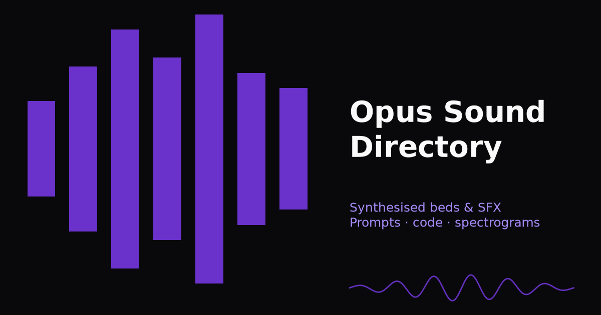
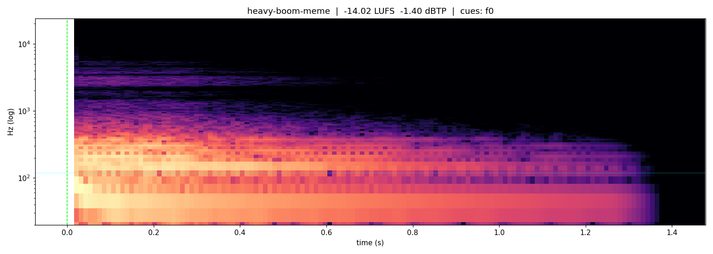

<div align="center">

<a href="https://opussounds.directory">
  
</a>

# Opus Sounds Directory

**Find your sound. See how it was made. Make it your own.**

An open directory of synthesized sound effects, music beds and loops for videos, games and apps.

[](https://opussounds.directory) [](ASSETS-LICENSE.md) [](LICENSE)

[](https://github.com/Tguntenaar/opus-sound-directory/stargazers) [](https://github.com/Tguntenaar/opus-sound-directory/commits/main) [](CONTRIBUTING.md)

[Browse the directory](https://opussounds.directory) · [Submit a sound](https://opussounds.directory/submit) · [Read the blog](https://opussounds.directory/blog) · [Connect an AI assistant](#use-with-ai-assistants)

</div>

> [!TIP]
> **Yes, you can use the sounds commercially.** Download, edit, remix and use the audio in your own projects without permission or attribution. Sounds are **CC0**; source code is **MIT**. [Full licensing details ↓](#license)

## Contents

- [Explore by category](#explore-by-category)
- [Start listening](#start-listening)
- [What comes with a sound](#what-comes-with-a-sound)
- [Use with AI assistants](#use-with-ai-assistants)
- [Run locally](#run-locally)
- [Contribute](#contribute)
- [License](#license)

## Explore by category

| Collection | Find the right moment |
| :--- | :--- |
| [UI & app sounds](https://opussounds.directory/c/ui-sounds) | Taps, toggles, notifications and feedback for product interfaces. |
| [Drops & transitions](https://opussounds.directory/c/drops) | Impacts, whooshes and accents for cuts and reveals. |
| [Game sounds](https://opussounds.directory/c/gaming) | Arcade effects, chiptune gestures and game feedback. |
| [Cinematic hits](https://opussounds.directory/c/cinematic) | Braams, booms and trailer-sized impacts. |
| [Meme & reaction](https://opussounds.directory/c/meme) | Comic fails and reaction stings. |
| [Retro tech](https://opussounds.directory/c/retro-tech) | Dial tones, modems and nostalgic machine sounds. |
| [Risers](https://opussounds.directory/c/risers) | Tension builds timed to the frame. |
| [Ambient beds](https://opussounds.directory/c/ambient) | Background textures, atmospheres and loops. |
| [Ad beds by length](https://opussounds.directory/c/ad-beds) | Short beds for bumpers, product videos and ads. |
| [Logo stings](https://opussounds.directory/c/logo-stings) | Brief musical signatures for intros and reveals. |
| [Chaos → calm](https://opussounds.directory/c/chaos-calm) | Tension that resolves into space and calm. |

## Start listening

A few entry points into the collection. Open a sound to listen and download it.

| Sound | Use it for |
| :--- | :--- |
| [Shock boom](https://opussounds.directory/e/heavy-boom-meme) | A reaction cut or sudden zoom. |
| [Pass-by whoosh](https://opussounds.directory/e/whoosh-pass-by) | A fast transition or moving object. |
| [Cozy UI sprite](https://opussounds.directory/e/ui-cozy-sprite) | A coordinated set of small product interactions. |
| [Endless Shepard riser](https://opussounds.directory/e/endless-riser-shepard) | Sustained tension without a final hit. |
| [56k modem handshake](https://opussounds.directory/e/dialup-modem-56k) | A nostalgic connection sequence. |
| [Coin pickup sparkle](https://opussounds.directory/e/game-coin-pickup) | A collectible or positive reward. |

### Behind the sound

[](https://opussounds.directory/e/heavy-boom-meme)

*Shock boom: inspect its frequency content, read the synthesis code, then adapt it to your edit.*

## What comes with a sound

- **Audio to preview and download** — listen before choosing a file.
- **The creative prompt** — timing, character and synthesis direction.
- **Python synthesis code** — inspect how the sound is made and regenerate it.
- **Spectrograms and measurements** — duration, integrated loudness and true peak.
- **Timing and attribution** — frame cues, sample rate, generation date and model metadata.

The catalog focuses on procedural synthesis with NumPy and SciPy. Model attribution is recorded per entry; generation archives retain the provenance of experiments and candidate takes.

<details>
<summary><strong>Explore the source and candidate takes</strong></summary>

| Path | Contents |
| :--- | :--- |
| [`content/entries/`](content/entries/) | Catalog metadata, prompts and timing. |
| [`public/assets/`](public/assets/) | Published audio, synthesis scripts and spectrograms. |
| [`masters/`](masters/) | Full-rate audio masters. |
| [`runner/`](runner/) | Synthesis, mastering and verification tools. |
| [`provenance/`](provenance/) | Generation history and review candidates. |
| [Codex Hero8 collection](provenance/codex-generations/README.md) | 27 alternative takes, an offline listening page and QA reports. |

The Hero8 archive records its own selection status and Codex attribution. Candidate rankings are provisional; see its report before choosing by ear.

</details>

## Use with AI assistants

Search the directory and retrieve sound prompts through the public [MCP endpoint](https://opussounds.directory/mcp).

```json
{
  "mcpServers": {
    "opus-sounds": {
      "url": "https://opussounds.directory/mcp"
    }
  }
}
```

Read tools include `search_sounds`, `get_sound`, `list_categories` and `get_prompt_template`. Submission tools use the same review queue as the website. [MCP and review details](docs/DEVELOPMENT.md#remote-mcp-server-mcp).

## Run locally

Requires **Node.js 22.18 or newer**. The repo includes an `.nvmrc`.

```bash
git clone https://github.com/Tguntenaar/opus-sound-directory.git
cd opus-sound-directory
npm install
npm run dev
```

Open **[localhost:43123](http://127.0.0.1:43123)**.

| I want to… | Go here |
| :--- | :--- |
| Generate or add a sound | [Adding an entry](docs/DEVELOPMENT.md#adding-an-entry) |
| Understand the audio pipeline | [Runner guide](docs/DEVELOPMENT.md#runner-runner) |
| Build or deploy the site | [Development and operations](docs/DEVELOPMENT.md) |
| Review community submissions | [Review workflow](docs/DEVELOPMENT.md#reviewing-submissions) |
| Read the sound-generation history | [Provenance](provenance/README.md) |

## Contribute

Sign in with GitHub or Google to submit a sound and track its review in [your account](https://opussounds.directory/account). Browsing, downloads, and MCP search remain open. Agent submissions use revocable account tokens; your sign-in email stays private.

Have a sound idea, a better synthesis approach or a fix? [Open an issue](https://github.com/Tguntenaar/opus-sound-directory/issues/new), [submit a sound](https://opussounds.directory/submit), or send a pull request.

Read the [contribution guide](CONTRIBUTING.md) for audio requirements, attribution and licensing. If the directory helps your work, a GitHub star helps others find it.

## License

**Everyone can use this project, including for commercial work.**

| Material | License | What that means |
| :--- | :--- | :--- |
| Audio, spectrograms and sound prompts, including masters and archived candidate takes | [CC0 1.0](ASSETS-LICENSE.md) | Copy, edit, remix, redistribute and use commercially without asking permission or giving credit. |
| Application code, synthesis scripts, configuration, tooling and documentation | [MIT](LICENSE) | Use, modify, distribute and sell; retain the copyright and license notice in copies or substantial portions. |

See the [asset scope](ASSETS-LICENSE.md), [full CC0 text](LICENSES/CC0-1.0.txt) and [MIT license](LICENSE). Third-party dependencies retain their own licenses. CC0 does not grant trademark or endorsement rights.

---

<div align="center">

**A sound directory you can listen to, learn from and build on.**

[Browse sounds](https://opussounds.directory) · [Contribute](CONTRIBUTING.md) · [Back to top](#opus-sounds-directory)

</div>
